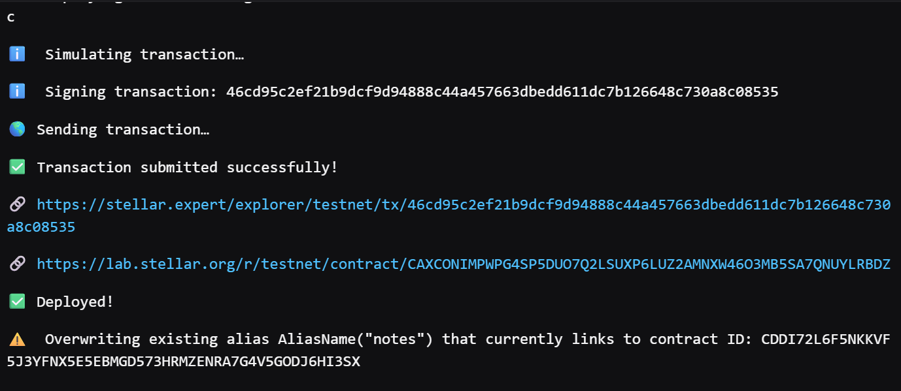
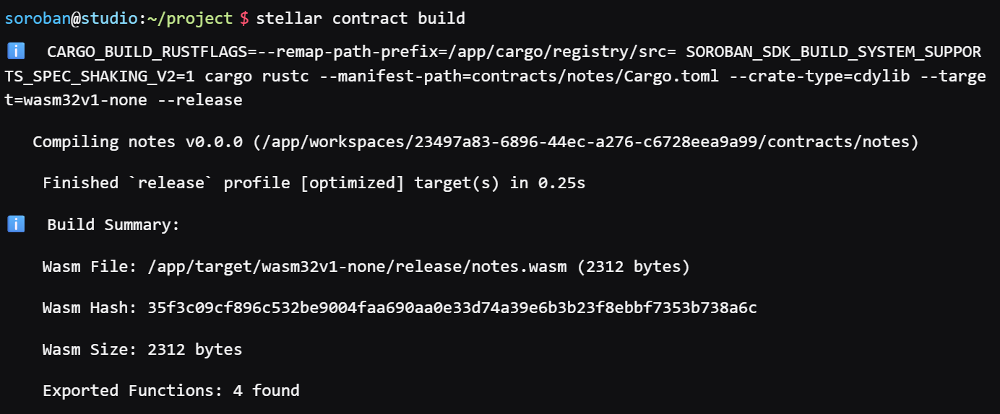
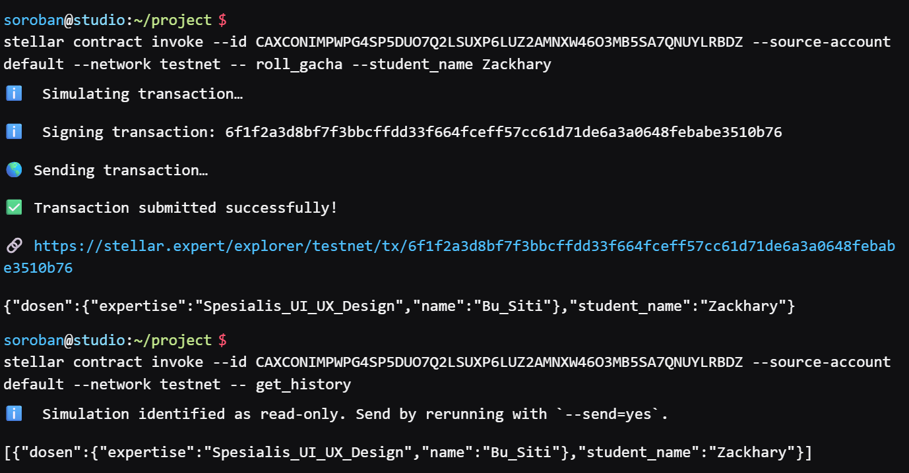

🎲 Thesis Advisor Gacha DApp

Transparent & Tamper-Proof Blockchain-Based Thesis Advisor Allocation System

📖 Project Description

Gacha Dosen DApp is a decentralized smart contract solution built on the Stellar blockchain network using the Soroban SDK.

Its primary function is to randomly and fairly allocate thesis advisors (Dosen Pembimbing) to students. Unlike traditional manual systems, this application uses blockchain-based random generation to ensure 100% fairness, transparency, and immutability. Every allocation is permanently recorded on the Stellar network, making the process verifiable by both students and university administration.

🎯 Project Vision

The goal of this project is to modernize academic administration by:

100% Fairness: Eliminating human bias or favoritism through on-chain random generation.

Transparency: Providing a public record of the advisor pool and draw history that anyone can verify.

Immutability: Ensuring that once a result is generated, it cannot be tampered with or deleted.

Web3 Integration: Implementing blockchain technology to solve real-world academic allocation challenges.

✨ Key Features

1. Dynamic Advisor Pool

Administrators can securely add lecturers to the gacha pool.

Supports detailed metadata including lecturer names and their specific fields of expertise (e.g., Full-Stack Development, UI/UX Design).

2. Provably Fair Gacha Engine

Powered by Soroban's secure built-in Pseudo-Random Number Generator (PRNG).

One-click allocation matching students with available advisors instantly.

Smart guards to prevent execution if the pool is empty.

3. Immutable History Ledger

A real-time, transparent log of all assignment results stored on-chain.

Easily track and verify which advisor was assigned to which student.

4. Stellar Network Performance

Built on Stellar Testnet for high-speed transactions and near-zero costs.

Scalable architecture designed to handle faculty-wide allocations.

🔗 Smart Contract Details

Network: Stellar Testnet

Contract ID: CAXCONIMPWPG4SP5DUO7Q2LSUXP6LUZ2AMNXW46O3MB5SA7QNUYLRBDZ

📸 Testnet Interaction Screenshots

🚀 Future Roadmap

Modern Web UI: Developing a frontend with Laravel and Tailwind CSS for a better user experience.

Gacha Animations: Adding interactive "loot box" style animations designed in Figma.

Quota Management: Implementing maximum student limits per advisor to balance workloads.

Admin Access Control: Restricting administrative functions to authorized wallets only.

🛠️ Technical Requirements

Soroban SDK

Rust Programming Language

Stellar CLI & Freighter Wallet

💻 How to Run & Interact

You can interact with this contract on the Stellar Testnet using the following commands:

1. Populate the Advisor Pool:

stellar contract invoke --id CAXCONIMPWPG4SP5DUO7Q2LSUXP6LUZ2AMNXW46O3MB5SA7QNUYLRBDZ --source-account default --network testnet -- add_dosen --name Pak_Budi --expertise Spesialis_Web_Dev

2. Roll the Gacha!

stellar contract invoke --id CAXCONIMPWPG4SP5DUO7Q2LSUXP6LUZ2AMNXW46O3MB5SA7QNUYLRBDZ --source-account default --network testnet -- roll_gacha --student_name Zackhary

3. View Assignment History:

stellar contract invoke --id CAXCONIMPWPG4SP5DUO7Q2LSUXP6LUZ2AMNXW46O3MB5SA7QNUYLRBDZ --source-account default --network testnet -- get_history

Gacha Dosen DApp - Securing Academic Fairness on the Stellar Blockchain.
